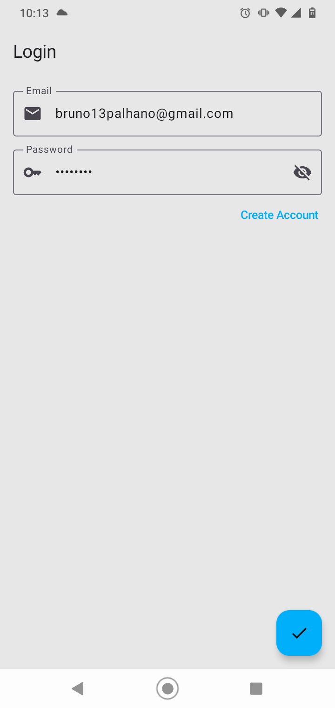
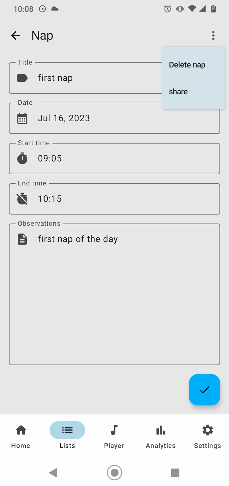
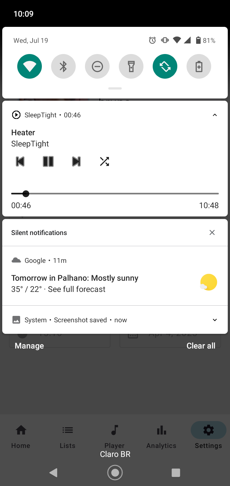

# SleepTight App

## Tracking Baby Development
* Play white noise in the background.
* Record the baby's measurements.
* Record baby naps during the day.
* Visualize baby information with charts.
* Set reminders ang get notified.

## Dark Theme Samples

     

    

## Light Theme Samples

    

    

## Play white noise in the background.

  

